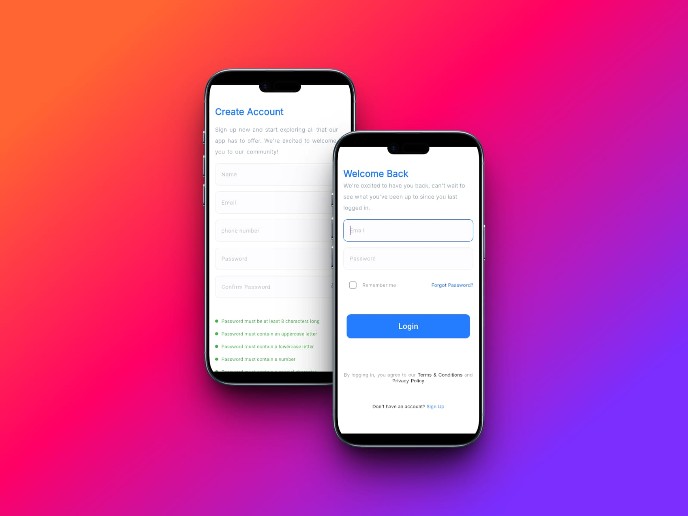
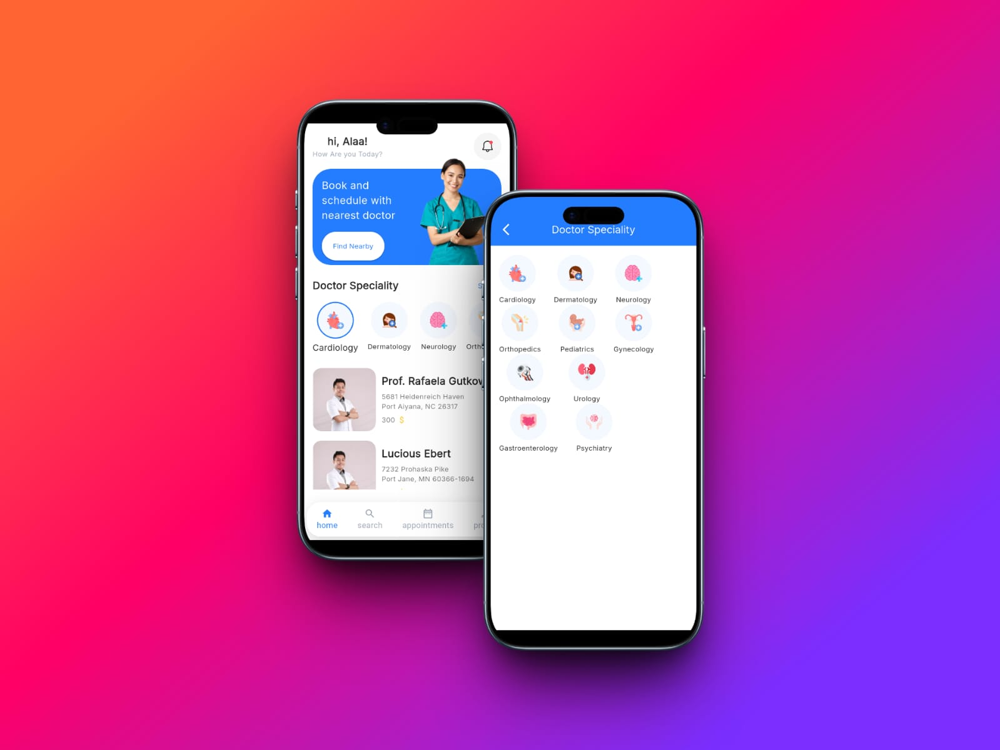
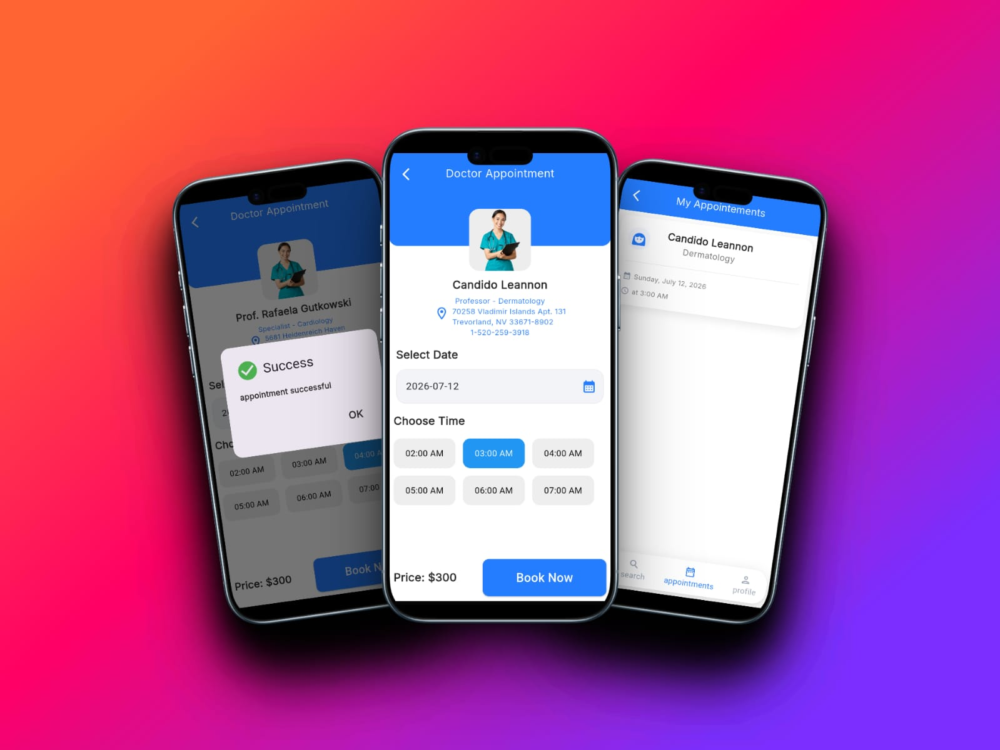
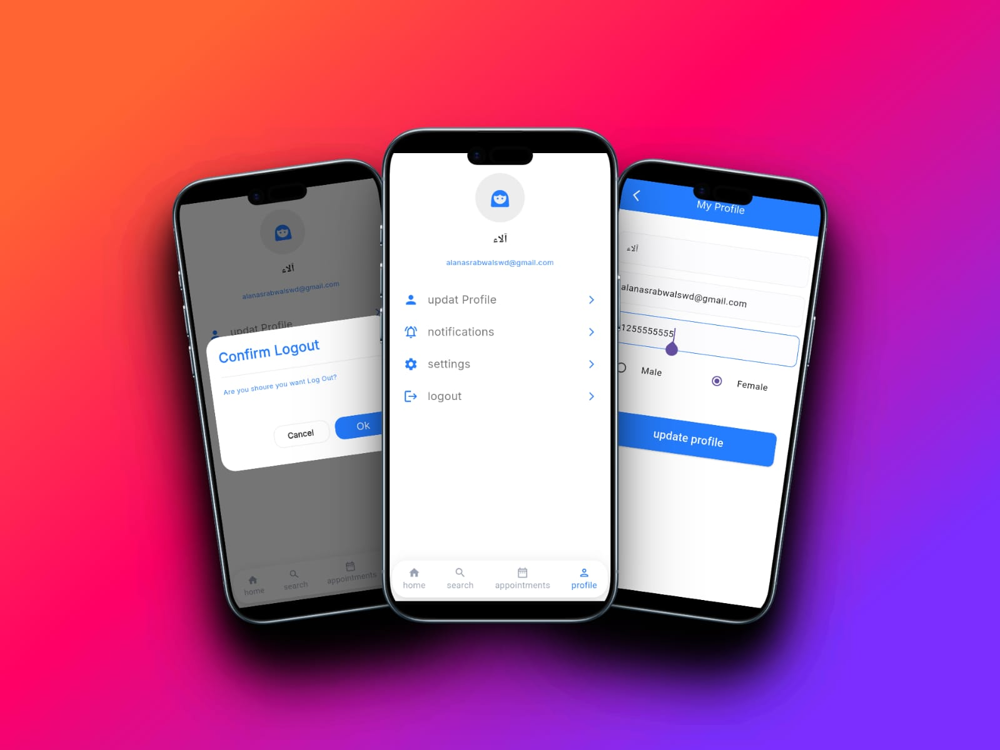
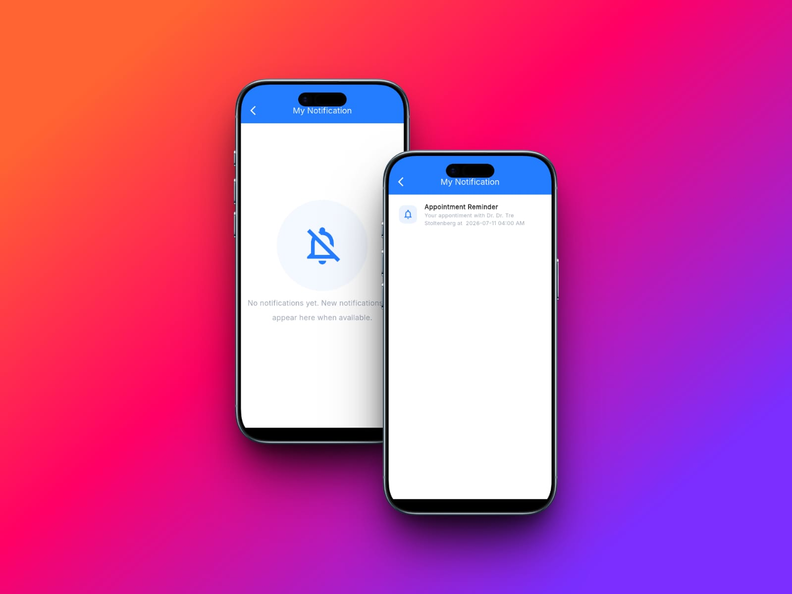

# 🩺 Doctor Appointment App

A Flutter application that allows users to find doctors, browse specialists, book appointments, and manage their profiles with a clean and user-friendly interface.

 

-----

## ✨ Features

### 🔐 Authentication
- Sign In
- Sign Up
- Form Validation
- Secure Authentication

### 🏠 Home
- Display doctors
- Display medical specialists
- Featured doctors
- Doctor details

### 🔍 Search
- Search doctors by name

### 📅 Appointment Booking
- Book appointments
- View appointment details
- Appointment confirmation

### 🔔 Notifications
- Receive appointment notifications
- Reminder before appointment

### 👤 Profile
- View profile
- Edit profile information
- Logout

---

## 🛠️ Tech Stack

- Flutter
- Dart
- Cubit (flutter_bloc)
- Dio
- REST API
- Clean Architecture

---

## 📂 Project Structure

```
lib/
│
├── core/
├── features/
│   ├── auth/
│   ├── home/
│   ├── search/
│   ├── profile/
│   └── appointment/
│
└── main.dart
```

---
## 📸 Screenshots

### Splash & Onboarding


### Login & Sign Up



### Home



### Book Appointment



### Search


### Profile



### Notifications



---

## 🚀 Getting Started

Clone the repository

```bash
git clone https://github.com/alaaNasserEzat/doc_doc.git
```

Go to the project directory

```bash
cd doc_doc
```

Install dependencies

```bash
flutter pub get
```

Run the application

```bash
flutter run
```

---

## 📦 Dependencies

  cupertino_icons
  flutter_svg
  flutter_native_splash
  dio
  dart_either
  flutter_bloc
  get_it
  flutter_secure_storage
  shared_preferences
  pretty_dio_logger
  skeletonizer
  intl
  timezone
  flutter_local_notifications

---

## 📱 Architecture

The project follows **Clean Architecture** with feature-based organization.

- Presentation Layer
- Business Logic (Cubit)
- Data Layer
- Repository Pattern
- REST API Integration

---

## 👨‍💻 State Management

This project uses **Cubit (flutter_bloc)** for state management to provide a predictable and scalable architecture.

---

## 🌐 API

Network requests are handled using **Dio**, providing:

- API communication
- Error handling
- Request interceptors
- Response parsing

---

## 📄 License

This project is for educational and portfolio purposes.
